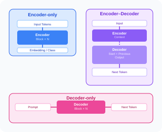

# Day 02 — Transformer의 모델 종류와 구조

**Week 01 — VLA 이전의 시간**  
**학습 날짜:** 2026-08-18

---

## 1. Transformer 계열 구조



---

## 2. 배경지식

### 2.1 Encoder

- 입력을 이해해서 특징 벡터로 바꾸는 부분
- 문장이 들어오면 모든 단어를 동시에 보고 문맥을 반영한 표현으로 바꾼다.
- 사용하는 attention은 self-attention이며, 모든 토큰이 한 시퀀스에서 서로 자유롭게 볼 수 있다.

```
Encoder 구조

Input
 ↓
Multi-Head Attention
 ↓
Residual + LayerNorm
 ↓
FFN
 ↓
Residual + LayerNorm
 ↓
Output
```

대표 모델
- BERT : 문장 이해, 분류
- ViT : 이미지 이해

> Encoder는 입력을 이해, 출력은 문장이 아니라 의미를 담은 벡터

### 2.2 Decoder

- 출력을 한 토큰씩 생성하는 부분
- Encoder와는 다르게 미래의 토큰은 볼 수 없음(Masked self-attention)
- Query는 한쪽 시퀀스에서, Key, Value는 다른 시퀀스에서 참조(cross-attention)

ex)
```
<START>
   │
   ▼
"사"
   │
   ▼
"사랑"
   │
   ▼
"사랑해"
```

```
Decoder 구조
입력
 ↓
Masked Self-Attention
 ↓
Residual + LayerNorm
 ↓
Cross-Attention  ◄──── Encoder Output
 ↓
Residual + LayerNorm
 ↓
FFN
 ↓
Residual + LayerNorm
 ↓
출력
```

#### Masked Self-Attention
학습 중에 모델이 자기가 맞춰야 할 다음 토큰을 미리 보는 것을 방지한다.  
그래서 attention 점수 행렬에서 현재 토큰이 자기 미래의 토큰을 참고하는 자리들을 모두 가린다.  

```
autogressive mask

        토큰1   토큰2   토큰3   토큰4
토큰1 [   ✓    -∞    -∞    -∞  ]
토큰2 [   ✓     ✓    -∞    -∞  ]
토큰3 [   ✓     ✓     ✓    -∞  ]
토큰4 [   ✓     ✓     ✓     ✓  ]

```

#### Cross-Attention
- Encoder와 Decoder를 연결하는 부분
- Query는 Decoder에서, Key, Value는 Encoder에서 참조

## 전체 구조

ex) I love you를 번역할 때

```
                 "I love you"
                       │
                       ▼
                 ┌──────────┐
                 │ Encoder  │
                 └────┬─────┘
                      │
                      │ Encoder Output
                      ▼
        ┌──────────────────────────┐
        │         Decoder          │
        │                          │
<START> │ → Masked Self-Attention  │
        │           ↓  (Q)         │
        │     Cross-Attention ◄────┤ Encoder Output(K, V)
        │           ↓              │
        │          FFN             │
        │           ↓              │
        │      "나는" 생성          │
        └──────────────────────────┘
                       │
                       ▼
              <START> 나는
                       │
                       ▼
        ┌──────────────────────────┐
        │         Decoder          │
        │                          │
        │ → Masked Self-Attention  │
        │           ↓  (Q)         │
        │     Cross-Attention ◄────┤ Encoder Output(K, V)
        │           ↓              │
        │          FFN             │
        │           ↓              │
        │       "너를" 생성         │
        └──────────────────────────┘
                       │
                       ▼
             <START> 나는 너를
                       │
                       ▼
                  ... 반복 ...
                       │
                       ▼
                나는 너를 사랑해

```
예를 들어 I love you를 번역할 때 우선, 각 단어는 토큰 임베딩을 거쳐 벡터화 되고, , Positentional Encoding이 더해진다.  
이 벡터는 Encoder에 들어가고, Encoder는 문장을 이해한다. Decoder는 Masked Self-Attention을  
거쳐서 현재까지 생성된 내용을 이해한다. 이때, Decoder의 현재상태가 Q가 되고 Encoder의 출력이 K, V가 된다.
Cross-Attention에서 디코더 토큰의 Q가 인코더 토큰의 K, V를 만나면 디코더가 원문에서 어떤 부분을 참고할지 결정한다.  
이 결과가 FFN을 거쳐 출력이 만들어진다.

---

## 2.3 Decoder-only
- 일반적인 transformer에서 필요한 encoder, decoder에서 encoder를 제거한 형태
- 최근 LLM, VLA는 거의 모두 decoder-only 구조이다.
- 입력과 출력을 따로 나누지 않고 이전 토큰들을 보고 다음 토큰을 예측

**Autoregressive Generation** : 지금까지 생성한 결과를 다시 입력으로 사용해서 다음 토큰을 생성하는 방식
```
입력 -> Decoder -> 다음 토큰 -> 기존 입력에 추가 -> Decoder -> 다음 토큰 ...
```
>> 토큰의 계산은 병렬화할 수 있지만, 생성 자체는 미래 토큰을 볼 수 없기 때문에 순차적으로 진행된다.


### 전체 구조

```
입력 토큰
   │
   ▼
Token Embedding
   +
Positional Information
   │
   ▼
┌─────────────────────────┐
│    Decoder Block        │
│                         │
│ Causal Self-Attention   │
│          ↓              │
│ Residual + LayerNorm    │
│          ↓              │
│ FFN                     │
│          ↓              │
│ Residual + LayerNorm    │
└────────────┬────────────┘
             │
             ▼
       Decoder Block
             │
             ▼
            ...
             │
             ▼
       Linear + Softmax
             │
             ▼
        다음 Token
```
## 실제 VLA에서 Decoder-only
```
카메라 이미지
     │
     ▼
Vision Encoder
     │
     ▼
Visual Tokens
     │
     │
     ├──────────┐
     │          │
     ▼          ▼
Visual Token  Language Token
     │          │
     └────┬─────┘
          ▼
    Decoder-only
    Transformer
          │
          ▼
       Action
```
>> Decoder-only의 한 줄 요약 : 현재까지의 정보를 보고 다음 행동을 생성하는 모델