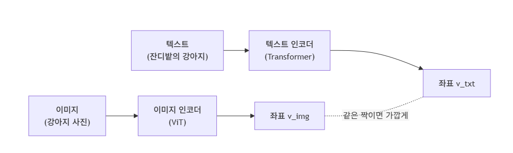

# Day 04 — CLIP

**Week 01 — VLA 이전의 시간**  
**학습 날짜:** 2026-08-29

---

## 1. 핵심 개념

| 용어 | 설명 |
|---|---|
| Zero-shot | 학습 데이터에 없던 task도 추가학습 없이 바로 처리하는 능력 |
| InfoNCE Loss | CLIP이 사용하는 contrastive 손실 함수 |

---

## 2. 배경지식

ViT 이전까지의 비전 모델은 정해진 클래스 목록으로 학습됐다.  
예를 들어 "강아지냐, 고양이냐"는 답할 수 있어도  
"햇빛 아래 잔디밭에서 뛰노는 골든리트리버" 같은 자유로운 묘사는  
다룰 수 없었다.

> 사람이 이미지를 설명하는 방식은 자연어인데 모델은 n개의 카테고리에 갇혀있음

### 2.1 CLIP

**이미지와 텍스트를 함께 학습해서, 이미지와 문장의 의미를 연결하는 모델**

- 라벨 대신 인터넷에 떠도는 (이미지, 캡션)짝을 그대로 학습 데이터로 사용한다.

### 2.2 Constrastive Learning

큰 공간에서 이미지와 텍스트를 펼치고, 비슷한 것 끼리 가까이 모이게,  
무관하면 멀리 떨어지게 좌표를 조정한다.

> 같은 짝의 이미지, 텍스트는 가깝게, 다른 짝은 멀게 배치한다.

### 2.3 CLIP의 핵심 구조



1) Image Encoder
이미지를 입력받아 벡터로 변환한다.
```
Image
  ↓
Vision Transformer (ViT)
  ↓
Image Embedding

ex)
강아지 사진
     ↓
[0.12, 0.83, -0.21, ...]
```

2) Text Encoder
문장을 입력받아 벡터로 변환
```
"a photo of a dog"
          ↓
     Transformer
          ↓
    Text Embedding
```

학습이 끝나면 이미지 인코더와 텍스트 인코더가 같은 좌표계를 공유한다.  
예를 들어, "강아지 사진"의 좌표와 "강아지"라는 텍스트의 좌표가  
거의 같은 위치에 모이게 된다.

### 2.4 일반 ViT와 CLIP ViT의 차이

1) 일반 ViT
주로 이미지 자체를 이해한다

 ```
 ex)
 이미지
 ↓
ViT
 ↓
"강아지일 확률: 90%"
"고양이일 확률: 5%"
 ```

 2) CLIP ViT
 이미지를 언어와 연결할 수 있는 형태로 이해한다.

 ```
 Image Embedding
       ↕
Text Embedding
 ```

### 2.5 Zero-shot
학습 데이터에 없던 작업(task)도 추가 학습 없이 바로 처리하는 능력이다.  

*VLA에서 Zero-shot*  
로봇이 실제 환경에서 "Pick up the yellow banana"라는 새로운 명령이 들어왔을때
만약 모델이 : 
- 바나나라는 물체를 직접 조작한 데이터
- "Pick up the yellow banana"라는 로봇 행동 데이터
를 학습하지 않았어도, 명령을 이해하고 행동할 수 있으면  
**Zero-shot Generation**이라고 할 수 있다.  

*중요한 점*  
zero-shot은 모델이 바나나를 처음 봤다는 것이 아니다. 사전 학습에서  
관련된 데이터를 학습해야 성공할 가능성이 높다.

```
사전학습:
바나나 이미지와 텍스트를 봄

로봇 학습:
바나나를 집는 행동은 학습하지 않음

실제 테스트:
"바나나를 집어"
        ↓
       성공
```

ex) "이 사진이 사슴인가 소인가"를 물으려면 보통 그 데이터로 새로  
분류기를 학습해야 한다. 그러나 CLIP은 그럴 필요가 없다.

- 1) 각 클래스 이름("a photo of a deer")을 텍스트 인코더로 좌표로 만든다.
- 2) 이미지를 이미지 인코더로 좌표로 만든다.
- 3) 가장 가까운 텍스트 좌표를 답으로 고른다.

> 학습 0번으로 새 분류기가 만들어진다.

### 2.6 InfoNCE Loss
CLIP은 비슷한 이미지, 텍스트끼리 연결하는 목표를 가지고 있다.  
이때 얼마나 잘 연결하고 있는지 숫자로 계산하는 기준이 필요하다.  
이것이 손실함수(Loss)이다.

여기서 InfoNCE Loss는 정답 쌍의 유사도는 높이고, 나머지 틀린 쌍의 유사도는  
낮추는 손실함수이다.

한 배치 안에 이미지, 텍스트 짝이 n개 있을 때, 한 이미지에 대해 n개 텍스트 중  
진짜 짝을 골라내는 분류 문제로 학습한다.

---

## 3. VLA가 여기서 받은 것
VLA의 핵심 능력 중 하나는 "사람이 자연어로 명령하면, 그 명령에 맞는 행동을 한다"이다.  
그러려면 모델이 시각 장면과 언어를 같은 좌표계 안에서 이해해야 한다. CLIP은 VLA의  
"자연어로 시각을 제어한다"는 능력을 제공한다.

> CLIP은 사진과 글을 같은 좌표계 위에 살게 한 논문이다. VLA의 자연어 명령 처리 능력은 이 좌표계로 부터 나왔다.