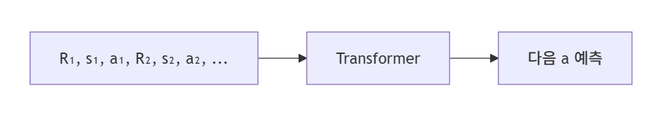

# Day 05 — Decision Transformer

**Week 01 — VLA 이전의 시간**  
**학습 날짜:** 2026-09-02

---

## 1. 핵심 개념

| 용어 | 설명 |
|---|---|
| 강화학습 | 환경에서 행동을 시도해 보고 보상(reward)을 신호 삼아 학습하는 분야이다. 행동(action), 상태(state), 보상(reward)이 핵심 단어 |
| 정책(policy) | **지금 상태에서 어떤 행동을 할지**를 결정하는 함수이며, 강화학습이 학습하려는 대상이다. |
| Offline RL | 환경과 상호작용하지 않고 **이미 수집된 데이터**로만 학습하는 방식 |
| Trajectory(궤적) | 한 번의 에피소드(task 수행 한 회)에서 시간 순서대로 기록된(상태, 행동, 보상)의 나열 |

**문제 상황**

- 학습이 불안정 하다.
  가치 함수를 추정하면서 정책을 갱신하는 과정이 잘못하면 발산한다.

- 사람이 시연한 좋은 데이터를 잘 살리지 못했다.
  미리 모은 좋은 데이터가 있어도, 보상 기반 학습 틀에 끼워넣기가 어색했다.

---

## 2. 배경지식

### 2.1 Decision Transformer

강화학습 문제를 좋은 행동 시퀀스를 예측하는 문제로 변환하여 Transformer로 행동을 생성하는 모델

기본 작동 원리
```
과거 상태 + 과거 행동 + 원하는 성과
                ↓
          Transformer
                ↓
           다음 행동 예측
```

> 자신이 원하는 만큼의 성과를 얻으려면, 지금 어떤 행동을 해야 하나

### 2.2 Return-to-Go
학습 데이터를 다음과 같은 시퀀스로 적는다.
```
(R₁, s₁, a₁,  R₂, s₂, a₂,  R₃, s₃, a₃,  ... )
```
- s = 상태(state)
- a = 행동(action)
- R = 지금부터 episode 끝까지 남은 보상의 총합(return-to-go)

이 시퀀스를 GPT처럼 입력해서 다음 행동(a)을 예측하도록 학습한다.

ex)
어떤 에피소드에서 이런 보상이 나왔을때
```
시간

t=1     t=2     t=3
 │       │       │
Reward
 1       2       3
```
전체 보상은 : 1 + 2 + 3 = 6

각 시점에서 앞으로 받을 보상의 합을 계산하면
- t=1 -> RTG₁ = 1 + 2 + 3 = 6
- t=2 -> RTG₂ = 2 + 3 = 5
- t=3 -> RTG₃ = 3

RTG = [6, 5, 3]이다.

### 2.3 RTG를 넣는 이유
ex) 학습 데이터게 이런 데이터가 있을 때
```
비슷한 State S

데이터 1:
S → Action A → 낮은 성과

데이터 2:
S → Action B → 높은 성과
```

RTG가 없으면 모델은 
```
State S
   ↓
Action A와 Action B를 모두 학습
```
하게 된다.
즉, 모델은 어떤 행동을 해야할지 모르는 문제가 생긴다.

RTG를 넣을 경우
```
RTG = 낮음 + State S
        ↓
     Action A

RTG = 높음 + State S
        ↓
     Action B
```
처럼 행동을 구분할 수 있는 정보가 생긴다.

```
낮은 RTG + 현재 상태
        ↓
낮은 누적 보상과 연결된 행동을 선택

높은 RTG + 현재 상태
        ↓
높은 누적 보상과 연결된 행동을 선택
```

> 같은 상태에서도 원하는 성과에 따라 다른 행동을 선택할 수 있도록 모델에 목표 조건을  
> 제공하기 위해서이다.

---

## 3. Decision Transformer의 입력 구조
Decision Transformer의 핵심 구조는 다음과 같다.
(R1​,s1​,a1​,R2​,s2​,a2​,…)

즉
```
RTG₁ → State₁ → Action₁
RTG₂ → State₂ → Action₂
RTG₃ → State₃ → Action₃
```

이것들을 하나의 시퀀스로 Transformer에 넣는다.
```
┌─────┬───────┬────────┐
│ RTG │ State │ Action │
└─────┴───────┴────────┘
        t=1

┌─────┬───────┬────────┐
│ RTG │ State │ Action │
└─────┴───────┴────────┘
        t=2

┌─────┬───────┬────────┐
│ RTG │ State │ Action │
└─────┴───────┴────────┘
        t=3
```

---

## 4. GPT와 비슷한 이유
```
GPT :                      Decision Transformer : 

이전 단어들                 이전 RTG + 상태 + 행동
    ↓                            ↓
다음 단어 예측                다음 행동 예측
```

즉, GPT는 다음 토큰을 예측하고 Decision Transformer는 다음 액션을 예측한다.

---

## 5. Offline RL
Decision Transfomer의 큰 특징은 Offline RL 데이터셋을 사용할 수 있다는 것이다.

ex)
예를 들어 과거에 수집한 로봇 데이터가 있을 때
```
Trajectory 1
State → Action → Reward

Trajectory 2
State → Action → Reward

Trajectory 3
State → Action → Reward
```

여기에는
```
좋은 행동 데이터 + 평범한 행동 데이터 + 나쁜 행동 데이터
```
가 전부 들어있을 수 있다.

먼저 각 Trajectory에서 RTG를 계산한다.
```
State₁
Action₁
Reward₁

↓

RTG₁ 계산
```

그리고 Transformer에
```
RTG₁, State₁
       ↓
Action₁ 예측
```
을 학습시킨다.

> 환경과 직접 상호작용하지 않고 이미 수집된 Trajectory 데이터로만 학습할 수 있다.

---

## 6. 실제 추론 과정
예를 들어 로봇에게 "목표 성과 = 100"을 주었다.

1) RTG = 100, State = 현재 상태를 입력한다.
```
RTG₁
  ↓
State₁
  ↓
Transformer
  ↓
Action₁ 생성
```

2) 로봇이 행동을 실행한다.
```
Action₁
   ↓
Environment
   ↓
Reward₁ = 10
```

3) 그리고 남은 목표 보상을 업데이트한다.
```
RTG₂ = 100 - 10 = 90
```

4) 다음 단계
```
RTG₂ = 90
State₂
Action₁ (과거 행동)
      ↓
Transformer
      ↓
Action₂
```

이 과정을 반복한다.

---

## 7. 전체 구조


실제로는 이 토큰들을 Transformer에 순서대로 입력하고, Causal Attention을 사용해서 미래 정보를  
보지 못 하게한다.

---

## 8. VLA가 여기서 받은 것
Decision Transformer는 행동도 토큰처럼 다룬다는 인식의 전환을 보여주었다. 행동을 작은 단계로  
양자화하여 토큰으로 만든 뒤, 언어 토큰과 같이 시퀀스 예측 문제로 푼다는 발상이 이후 RT-1, RT-2  
의 행동 출력 방식의 밑거름이 되었다.

> 강화학습을 "보상을 최대로 받게하는 행동을 찾는 것이 목표"에서 "시퀀스 예측 문제"라는 발상의 전환