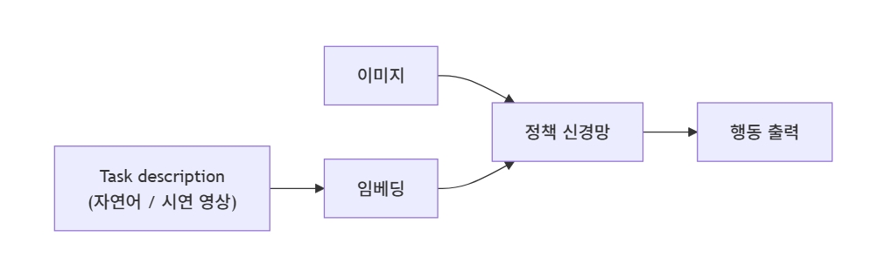

# Day 01 — BC-Z

**Week 02 — 모방학습의 시작**  
**학습 날짜:** 2026-09-05

---

## 1. 핵심 개념

| 용어 | 설명 |
|---|---|
| 모방학습(BC) | "사람의 시연을 따라해라"를 학습 목표로 삼는 분야. 사실상 로봇 학습의 표준 |
| 시연 데이터 | 사람이 로봇을 직접 조종한 기록. 시간 순서대로 (관측, 행동)쌍이 나열된다. 한 번의 task 수행이 한 trajectory가 된다. |
| Behavioral Cloning (BC) | (관측, 행동) 쌍을 지도학습 문제로 보는 가장 단순한 모방학습 방식. ("이 그림이 나오면 이 행동을 해라"를 외우게 하는 것) |
| Covariate Shift | BC의 가장 큰 한계. 학습 데이터의 분포와 실제 작동할 때 마주치는 분포가 어긋나는 현상. |
| DAgger (Dataset Aggregation) | BC-Z 이전 covariate shift를 푸는 표준 방법. 학습된 정책을 굴려 보고, 분포 밖으로 흘러간 상태에서 사람이 다시 정답 행동을 알려준 데이터를 모아 재학습하는 반복 루프 |
| Multi-task Imitation Learning | 여러 task의 시연을 한 모델로 함께 학습하는 방식 |
| language conditioning | 자연어 task description을 모델 입력으로 쓰는 방식 |

---

## 2. BC
Behavior Cloning(BC) : 사람이 로봇을 조작한 데이터를 그대로 보고 따라 배우는 방법

- 입력 : 이미지
- 출력 : action
$$
수식 : a_t​=π_θ​(o​_t)

- o_t : 관측값
- a_t : 사람이 수행한 행동
- π_θ : 로봇 정책
$$

> 이 상황에서 사람이 이렇게 행동했으니 로봇도 똑같이 행동한다.

### 2.1 BC의 한계
2020년 경까지 모방학습은 거의 다 *task별로 따로 학습한 정책*이었다.  
("컵 집기"정책 따로, "서랍 열기"정책 따로) 이 방식에는 2가지 한계가 있었다.

- task가 늘어나면 모델도 늘어난다.
-> 100개 task면 100개 모델

- 새로운 task에 일반화가 안 된다.
-> 학습 시 못 본 task가 들어오면 처음부터 다시 학습해야 한다.

## 3. BC-Z
BC-Z : Behavior Cloning with Latent Goals

> 사람이 수행한 로봇 행동 데이터를 학습하고, 사용자가 원하는 목표를 주면 그 목표에 맞는 행동을 생성하는 모델

Z : Goal representation
여기서 Z는 "무엇을 하려고 하는지"를 나타내는 잠재적인 목표 표현이다.

수식
$$
a_t​ = π(o_t​, z)
$$

### 3.1 Task Conditioning
BC-Z의 입력은 두 가지이다.
- 현재 카메라 이미지 - 무엇이 보이는지
- task description - 무엇을 해야 하는지(자연어 혹은 시연 영상)

description을 임베딩 벡터롤 만들어 시각 특징을 결합한 뒤, 행동을 출력하는 신경망에 통과시킨다.  
이렇게 모델 입력에 "어떤 task인지"를 명시적으로 끼워넣는 걸 task conditioning이라고 한다.

구조
```
Task / Goal 
     ↓ 
Goal Encoder 
     ↓ 
     Z 
     │ 
     ↓ 
State ──────┐ 
            ↓ 
         Policy 
            ↓ 
         Action

```



최종적으로
```
State + Z
    ↓
Policy
    ↓
Action
```
가 된다.

### 3.2 Z가 필요한 이유
ex)
```
Z₁ = 컵 집기와 관련된 목표 표현
Z₂ = 병 집기와 관련된 목표 표현
Z₃ = 책 집기와 관련된 목표 표현
```

만약 state = 책상 앞이라고 할 때,
```
State + Z₁
      ↓
   컵을 집는 행동
```

또는
```
State + Z₂
      ↓
   병을 집는 행동
```
이 된다.

> 즉, Z는 어떤 행동을 해야 하는지 방향을 잡아주는 조건이 된다.

따라서 BC-Z에서 Z를 State와 함께 사용하는 것이 Task Conditioning의 핵심이다.

## 4. VLA가 여기서 받은 것
VLA의 정의가 비전과 언어 등의 정보를 입력으로 받아 로봇의 행동을 출력하는 모델이다.  
BC-Z는 실제 로봇에서 시각 정보와 task 정보를 조건으로 사용하여 행동을 생성하는 방식을  
보여준 중요한 연구이다. 
따라서 BC-Z는 "현재 상태만 보고 행동하는 Policy"에서 *task까지 조건으로 받아 행동하는 Policy*로 
발전했다는 점​을 중요하게 볼 수 있다.

> BC-Z는 "단순히 관측을 보고 행동을 복사하는 것"에서 나아가, 작업 정보를 함께 이용하여  
> 하나의 정책이 여러 작업을 학습하고 일반화하도록 만든다.