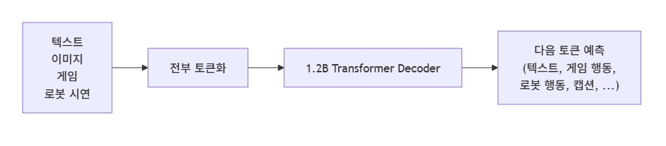

# Day 02 — Gato

**Week 02 - 모방학습의 시작**  
**학습 날짜:** 2026-09-09

---

## 1. 핵심 개념

| 용어 | 설명 |
|---|---|
| Generalist | 한 모델이 여러 task를 다 처리하는 모델 |
| Specialist | 한 task에만 특화된 모델 |
| Tokenization | 연속적인 값(이미지 픽셀, 로봇 관절 각도)을 정수 토큰 ID로 변환하는 과정 |

---

## 2. 배경 지식
기존 로봇 학습에서는 *특정 로봇과 특정 작업에 맞춰 하나의 모델을 학습하는 방식*이 일반적이었다.

예를 들어
```
집기 작업 → 집기 전용 모델 
이동 작업 → 이동 전용 모델
```
처럼 작업마다 별도의 모델이 필요했다.

따라서 하나의 모델이 여러 종류의 작업을 수행하기보다는, 각 작업에 맞는 전용 정책을 따로  
학습해야하는 한계가 있었다.

## 3. Gato
하나의 transformer가 다양한 종류의 데이터를 받아서 여러 종류의 행동을 수행하도록 만든 범용 에이전트 모델

> 핵심 아이디어 : 모든 입력과 출력을 토큰으로 변환하여 한 시퀀스로 펼친다

- 텍스트 -> 단어 토큰
- 이미지 -> 패치 토큰(ViT 토큰)
- 로봇 상태/행동 -> 양자화된 토큰

이 토큰 시퀀스를 하나의 Transformer가 다음 token을 예측하는 방식으로 학습한다. 




## 4. Generelist와 Specialist
Gato가 나온 시기까지 거의 모든 로봇 모델이 Specialist였다. Gato는 Generelist가  
가능하다는 것을 보여주었지만, 각 task 성능은 그 분야 Specialist에 못 미쳤다.  
단순히 가능하다는 증명에 더 가까웠다.

## 5. Tokenization
Gato는 연속 값을 정해진 구간으로 나눠(예 : 1024개 bin) 각 bin에 정수 ID를  
부여하는 방식을 썼다. 이 양자화 방식이 RT-1의 행동 토큰화와 발상이 비슷하다.

## 6. VLA가 여기서 받은 것
Gato는 **로봇 행동도 텍스트와 같은 시퀀스 안에서 다음 토큰 예측으로 학습할 수 있다**는 
사실을 보여주었다. VLA보다 넓은 개념인 Generelist Agent에 가깝고, 성능도 평범했지만,  
이 방향이 가능하다는 것을 증명하였다.

> Gato는 한 트랜스포머가 모든 것을 할 수 있다는 것을 보여주었다.