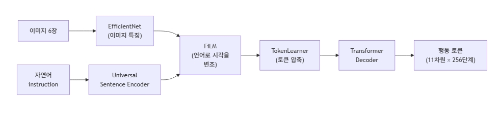

# Day 03 — RT-1

**Week 02 - 모방학습의 시작**  
**학습 날짜:** 2026-09-12

---

## 1. 핵심 개념

| 용어 | 설명 |
|---|---|
| EfficientNet | CNN계열 이미지 인코더. 모델의 깊이, 넓이, 해상도를 균형있게 키우는 *compound scaling* 발상으로, 같은 성능을 더 적은 파라미터로 달성한다. |
| USE(Universal Sentence) | 문장 임베딩 모델. 짧은 문장이나 명령을 고정 길이의 의미 벡터로 바꿔준다. |
| FiLM(Feature-wise Linear Modulation) | 언어 임베딩으로 시각 특징을 변조하는 기법. ex) "사과를 집어"라는 명령이 들어오면, 같은 이미지라도 사과 영역의 특징이 강조되도록 시각 표현을 살짝 비트는 것이다. |
| TokenLearner | 이미지 토큰의 수를 모델이 적응할 수 있게 줄여주는 모듈. ViT가 만든 수백 개의 패치 토큰을 그대로 쓰면 트랜스포머 연산이 너무 무거워지므로, TokenLeanear가 학습 가능한 attention으로 "중요한 정보만 담은" 8개 정도의 토큰으로 압축한다. |
| 행동 양자화 (Action Discretization) | 연속적인 행동 값을 정해진 개수의 구간으로 나눠 정수 토큰으로 만드는 방식. |

**행동 양자화**
RT-1은 각 차원의 값 범위를 256개 구간으로 균등하게 나누었다. 이렇게 하면 회귀(regression)가 아니라 분류(classification) 문제로 풀 수 있어, 트랜스포머의 cross-entropy loss와 자연스럽게 맞물린다. 다만 양자화 오차가 발생하므로 정밀한 제어에는 한계가 있다.

---

## 2. 배경지식
BC-Z가 *한 모델로 여러 task를 다루고*, Gato는 *하나의 모델이 여러 종류의 task를 수행할 수 있다*는 방향을 보여주었다.  
이 둘을 합쳐 **로봇에 특화된 대규모 트랜스포머 정책**을 만든것이 RT-1이다.

---

## 3. RT-1
Google이 2022년에 발표한 Transformer 기반 로봇 제어 모델

> 카메라 이미지와 자연어로 표현된 작업을 입력받아 로봇이 실제로 수행할 행동을 출력하는 transformer 정책

RT-1의 입력은 2가지이다.
- 카메라의 이미지
- 자연어 task instruction

### 3.1 이미지 
여기서 RT-1은 카메라의 이미지 인코더로 EfficientNet를 사용해서 visual feature를 만들고, 이를 트랜스포머가 사용할 수 있는  
형태로 변환한다.
```
이미지
  ↓
EfficientNet
  ↓
Visual Feature
  ↓
Token
  ↓
Transformer
```

### 3.2 discrete tokenization
연속적인 숫자를 미리 정해놓은 여러개의 구간으로 나누고, 각 구간을 하나의 토큰으로 표현하는 것

ex)
로봇의 그리퍼의 위치가 x = 0.37m일 때, x = 0.37이며, 이걸 일정한 구간으로  
나눌 수 있다.

```
0.00 ~ 0.10 → token 0
0.10 ~ 0.20 → token 1
0.20 ~ 0.30 → token 2
0.30 ~ 0.40 → token 3
0.40 ~ 0.50 → token 4
...

따라서
x = 0.37 → tocken 3이 된다.
```

### 3.3 Action Token
RT-1은 action을 discrete token 형태로 바꿔서 트랜스포머가 예측하도록 하였다.

이때 트랜스포머가 action을 예측하는 방법은 다음과 같다.

Transformer에 입력: 
```
이미지 정보 + 언어 정보 + 이전 상태/행동 정보
                 ↓
            Transformer
```
Transformer가 내부적으로 정보를 처리하고 마지막에 *각 action 값에 대한 예측 값을 만든다.*

ex)
```
x 방향:
token 0  → 0.02
token 1  → 0.03
token 2  → 0.05
...
token 7  → 0.82  ← 가장 높음
...
```
결과적으로 tocken 7을 선택한다.

그리고 이 토큰을 다시 실제 숫자로 변환한다.
```
tocken 7 → x = +0.12m
```
이런 식으로 로봇에게 전달한다.



> Discrete token은 연속적인 action값을 미리 정해둔 여러 구간으로 나눠 각각 번호를 붙인 것이고,  
> RT-1은 Transformer가 이 action tocken을 예측하도록 학습해서 그 결과를 다시 실제 로봇의 action값으로 변환한다.

## 4. VLA가 여기서 받은 것
RT-1은 대규모 로봇 시연 + 트랜스포머 + 행동 토큰화의 청사진을 처음으로 구현한 모델이다.  
이는 VLA의 직접적인 원형이라고 볼 수 있다. 