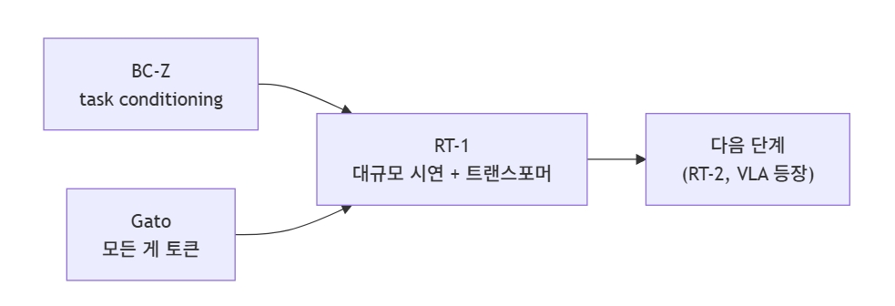

**Week 02 — 모방학습의 시작**  

# 전체 정리 및 요약
| 논문 | 핵심 발상 | 다음 단계로 넘어간 자리 |
|---|---|---|
| BC-Z (2021) | task conditioning, 한 모델 다중 task | 어떤 task인지를 입력으로 받는 형식 |
| Gato (2022) | 모든 모달리티를 토큰으로 통합 | 로봇 행동도 토큰이라는 개념 |
| RT-1 | 대규모 시연, 행동 토큰의 양자화 | VLA의 원형 |

RT-1으로 VLA의 원형이 완성되었으나 정밀한 양손 작업, multimodal 행동 분포의 표현은 여전히 풀리지  
않았다.

